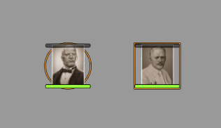
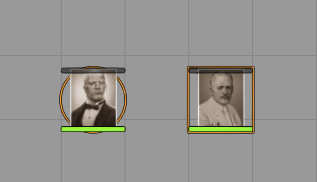
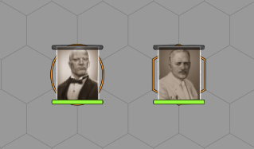

# Elliptical Token Shape

This module allows to display tokens with an ellipse shape on the scene, even when Foundry VTT doesn’t normally support it.
You can optionally force the ellipse shape for all PC tokens and/or all NPC tokens, regardless of scene or token settings.

## License

This project is licensed under the AGPL-3.0 License.
